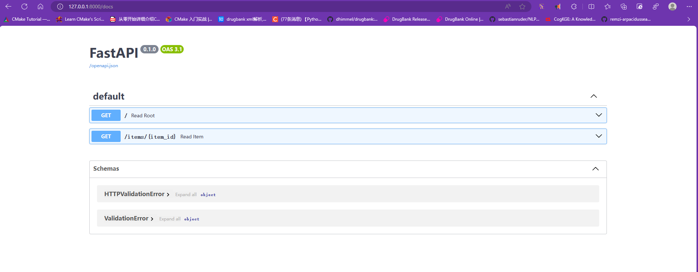

# simple-FastAPI

用于学习 [FastAPI](https://fastapi.tiangolo.com/zh/)，FastAPI 框架，高性能，易于学习，高效编码，生产可用。

>FastAPI 是一个用于构建 API 的现代、快速（高性能）的 web 框架，使用 Python 3.6+ 并基于标准的 Python 类型提示。

## 环境

```shell
git clone git@github.com:LuYF-Lemon-love/simple-FastAPI.git
cd simple-FastAPI/
python -m venv env
source env/bin/activate
which python
pip install --upgrade pip
pip install fastapi
pip install "uvicorn[standard]"
```

## 示例

1. 创建一个 `main.py` 文件并写入以下内容:

```python
from typing import Union

from fastapi import FastAPI

app = FastAPI()


@app.get("/")
def read_root():
    return {"Hello": "World"}


@app.get("/items/{item_id}")
def read_item(item_id: int, q: Union[str, None] = None):
    return {"item_id": item_id, "q": q}
```

<details><summary>或者使用 async def...</summary>

如果你的代码里会出现 `async` / `await`，请使用 `async def`：

```python
from typing import Union

from fastapi import FastAPI

app = FastAPI()


@app.get("/")
async def read_root():
    return {"Hello": "World"}


@app.get("/items/{item_id}")
async def read_item(item_id: int, q: Union[str, None] = None):
    return {"item_id": item_id, "q": q}
```

</details>

2. 通过以下命令运行服务器：

```shell
uvicorn main:app --reload
```

<details><summary>关于 uvicorn main:app --reload 命令......</summary>

`uvicorn main:app` 命令含义如下:

- `main`：`main.py` 文件（一个 Python "模块"）。
- `app`：在 `main.py` 文件中通过 `app = FastAPI()` 创建的对象。
- `--reload`：让服务器在更新代码后重新启动。仅在开发时使用该选项。

</details>

3. 使用浏览器访问 http://127.0.0.1:8000/items/5?q=somequery 。你将会看到如下 JSON 响应：

```json
{"item_id": 5, "q": "somequery"}
```

>你已经创建了一个具有以下功能的 API：
>
>- 通过 路径 `/` 和 `/items/{item_id}` 接受 HTTP 请求。
>- 以上 路径 都接受 `GET` 操作（也被称为 HTTP 方法）。
>- `/items/{item_id}` 路径 有一个 路径参数 `item_id` 并且应该为 `int` 类型。
>- `/items/{item_id}` 路径 有一个可选的 `str` 类型的 查询参数 `q`。

4. 现在访问 http://127.0.0.1:8000/docs 。你会看到自动生成的交互式 API 文档（由 Swagger UI生成）：



5. 访问 http://127.0.0.1:8000/redoc 。你会看到另一个自动生成的文档（由 ReDoc 生成）：


## 示例升级

1. 现在修改 `main.py` 文件来从 `PUT` 请求中接收请求体。我们借助 Pydantic 来使用标准的 Python 类型声明请求体。

```python
from typing import Union

from fastapi import FastAPI
from pydantic import BaseModel

app = FastAPI()


class Item(BaseModel):
    name: str
    price: float
    is_offer: Union[bool, None] = None


@app.get("/")
def read_root():
    return {"Hello": "World"}


@app.get("/items/{item_id}")
def read_item(item_id: int, q: Union[str, None] = None):
    return {"item_id": item_id, "q": q}


@app.put("/items/{item_id}")
def update_item(item_id: int, item: Item):
    return {"item_name": item.name, "item_id": item_id}
```

服务器将会自动重载（因为在上面的步骤中你向 uvicorn 命令添加了 --reload 选项）。

2. 访问 http://127.0.0.1:8000/docs 。交互式 API 文档将会自动更新，并加入新的请求体：


3. 点击「Try it out」按钮，之后你可以填写参数并直接调用 API：


4. 然后点击「Execute」按钮，用户界面将会和 API 进行通信，发送参数，获取结果并在屏幕上展示：


5. 访问 http://127.0.0.1:8000/redoc 。可选文档同样会体现新加入的请求参数和请求体：


## 总结

总的来说，你就像声明函数的参数类型一样只声明了一次请求参数、请求体等的类型。

你使用了标准的现代 Python 类型来完成声明。

你不需要去学习新的语法、了解特定库的方法或类，等等。

只需要使用标准的 Python 3.6 及更高版本。

## 深入学习

1. [教程 - 用户指南](https://fastapi.tiangolo.com/zh/tutorial/)

## 参考

1. [FastAPI](https://fastapi.tiangolo.com/zh/)